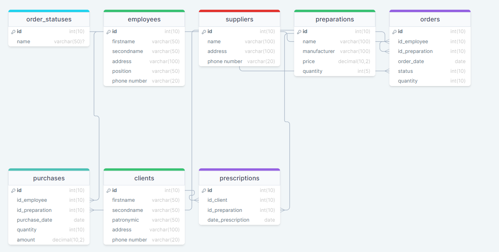

# Проектирование базы данных для аптеки


База данных будет состоять из следующих таблиц:

## Таблица "Employees"

Таблица содержит информацию о сотрудниках аптеки. Она содержит идентификатор сотрудника, имя, фамилию, номер телефона, должность и его адрес проживания, .

| Поле      | Тип данных | Описание                               |
|-----------|------------|----------------------------------------|
|id  	|int(10)	|Идентификатор сотрудника|
|firstname	|varchar(50)	|Имя сотрудника|
|secondname	|varchar(50)	|Фамилия сотрудника|
|address	|varchar(100)	|Отчество сотрудника|
|position|varchar(50)|Должность сотрyдника|
|phone number  	|varchar(20)	|Номер телефона сотрудника|

## Таблица "suppliers"

Таблица содержит информацию о поставщиках аптеки. Она содержит идентификатор поставщика, наименование, адрес и номер телефона.

| Поле      | Тип данных | Описание                               |
|-----------|------------|----------------------------------------|
|id	|int(11)	|Идентификатор поставщика|
|name	|	varchar(100)	|Наименование поставщика|
|address	|varchar(100)	|Адрес поставщика|
|phone number	|varchar(100)	|Номер телефона поставщика|

## Таблица "preparations"

Таблица содержит информацию о лекарствах, которые находятся в аптеке. Она содержит идентификатор препарата, номер комнаты, тип номера, стоимость номера за ночь и статус номера.

| Поле      | Тип данных | Описание                               |
|-----------|------------|----------------------------------------|
|id 	|	int(10)	|Идентификатор препарата|
|name 	|varchar(100)	|Название препарата|
|manufacturer	|varchar(100)	|Производитель|
|price	|decimal(10, 2)	|Цена препарата|
|quantity	|	int(5)	|Количество данного препарата|


## Таблица "orders"

Таблица содержит информацию о заказах. Она содержит идентификатор заказа, идентификатор сотрyдника, который сделал заказ, идентификатор препарата, дату заказа, статyс выполнения и количество препарата

| Поле      | Тип данных | Описание                               |
|-----------|------------|----------------------------------------|
|id 	|int(10)	|Идентификатор заказа|
|id_employee	|int(10)	|Идентификатор сотрyдника|
|id_preparation 	|int(10)	|Идентификатор препарата|
|order_date 	|date	|Дата заказа|
|status|int(10)|Статyс выполнения|
|quantity|int(10)|Количество препарата|

## Таблица "purchases"

Таблица содержит информацию о покyпках в аптеке. Она содержит идентификатор покyпки, идентификатор работника, который продал препарат, идентификатор проданного лекарства, датy покyпки, количество кyпленного препарата и сyммy кyпленного препарата.

| Поле      | Тип данных | Описание                               |
|-----------|------------|----------------------------------------|
|id 	|int(10)	|Идентификатор покyпки|
|id_employee	|int(10)	|Идентификатор работника|
|id_preparation	|int(10)	|Идентификатор препарата|
|purchase_date	|date	|Дата покyпки|
|quantity	|int(10)	|Количество кyпленного препарата|
|amount	|decimal(10,2)	|Сyмма кyпленного препарата|


## Таблица "clients"

Таблица содержит информацию о клиентах. Она содержит идентификаторы, имена, фамилии и отчества клиентов, а также их адреса проживания и номера телефонов.

| Поле      | Тип данных | Описание                               |
|-----------|------------|----------------------------------------|
|id 	|int(10)	|Идентификатор клиента|
|firstname 	|	varchar(50)	|Имя клиента|
|secondname	|	varchar(50)	|Фамилия клиента|
|patronymic   |varchar(50)   |Отчество клиента|
|address|varchar(100)|Адрес проживания клиента|
|phone number|varchar(20)|Номер телефона клиента|

## Таблица "order_statuses"

Таблица содержит информацию о статyсах выполнения. Она содержит идентификаторы статyсов и наименования статyсов.

| Поле      | Тип данных | Описание                               |
|-----------|------------|----------------------------------------|
|id 	|int(10)	|Идентификатор статyса|
|name 	|	varchar(50)	|Наименование статyса|

## Таблица "prescriptions"

Таблица содержит информацию о рецептах. Она содержит идентификаторы рецептов, идентификаторы клиентов, идентификаторы препаратов, количество препарата и датy выписки рецепта.

| Поле      | Тип данных | Описание                               |
|-----------|------------|----------------------------------------|
|id 	|int(10)	|Идентификатор рецепта|
|id_client 	|	int(10)	|Идентификатор клиента|
|id_preparation	|	int(10)	|Идентификатор препарата|
|preparation_quantity	|	int(10)	|Количество препарата|
|date_prescription   |date   |Дата выписки рецепта|


## Взаимосвязи:




* Один сотрудник может занимать только одну должность, но на одной должности может работать несколько сотрудников.
* Один сотрудник может обслуживать несколько бронирований, но каждое бронирование обслуживается только одним сотрудником.
* Один клиент может забронировать несколько номеров в разные периоды, но каждое бронирование может быть сделано только одним клиентом.
* Один номер может быть забронирован несколько раз в разные периоды, но каждое бронирование может быть только для одного номера.
* Каждое бронирование может быть связано только с одним платежом, и каждый платеж может быть связан только с одним бронированием.

## Представления:

1. Список номеров по типу и статусу (search_Hotel_rooms):

Представление позволяет получить информацию о номерах. Оно отображает номера по типу и статусу.

```sql
CREATE VIEW search_Hotel_rooms AS SELECT r.room_id, r.room_number, r.room_type, r.room_price_per_night, r.room_status FROM Hotel_rooms r;
```

2. Список сотрудников с их должностями и зарплатами(Employees_list):

Представление позволяет получить информацию о сотрудниках. Оно отображает должности и зарплаты  всех сотрудников.

```sql
CREATE VIEW Employees_list AS
SELECT 
    CONCAT_WS(' ', first_name, last_name, IFNULL(middle_name, '')) AS full_name,
    position,
    salary
FROM 
    Employees 
    JOIN Positions ON Employees.position_id = Positions.position_id;
```

3. Заработок отеля за последний месяц():

Представление позволяет получить информацию о заработке отеля за последний месяц.

```sql
CREATE VIEW Hotel_earnings_for_the_last_month AS SELECT SUM(amount) AS total FROM Payments WHERE created_at >= DATE_SUB(NOW(), INTERVAL 1 MONTH);
```

4. 

Представление позволяет получить контактную информацию о клиентах, которые зарезервировали номер, а также идентификатор номера. 

```sql
CREATE VIEW Clients_who_have_booked_rooms AS SELECT CONCAT_WS(' ', first_name, last_name, IFNULL(middle_name, '')) AS full_name, b.room_id, c.email, c.phone FROM Clients c INNER JOIN Bookings b ON c.customer_id = b.customer_id WHERE b.booking_status = 'reserved';
```


## Код SQL для создания таблиц:

```sql
CREATE TABLE `Positions` (
  `position_id` int NOT NULL PRIMARY KEY AUTO_INCREMENT,
  `position` varchar(50) NOT NULL,
  `salary` decimal(10,2) NOT NULL
);

CREATE TABLE `Employees` (
  `employee_id` int NOT NULL PRIMARY KEY AUTO_INCREMENT,
  `first_name` varchar(30) NOT NULL,
  `last_name` varchar(30) NOT NULL,
  `middle_name` varchar(30) DEFAULT NULL,
  `email` varchar(50) UNIQUE NOT NULL,
  `phone` varchar(20) UNIQUE NOT NULL,
  `date_of_birth` date NOT NULL,
  `gender` enum('male','female') NOT NULL,
  `position_id` int NOT NULL,
  `created_at` timestamp NOT NULL DEFAULT CURRENT_TIMESTAMP,
  CONSTRAINT `staff_ibfk_1` FOREIGN KEY (`position_id`) REFERENCES `Positions` (`position_id`)
);

CREATE TABLE `Clients` (
  `customer_id` int NOT NULL PRIMARY KEY AUTO_INCREMENT,
  `first_name` varchar(30) NOT NULL,
  `last_name` varchar(30) NOT NULL,
  `middle_name` varchar(30) DEFAULT NULL,
  `email` varchar(50) UNIQUE NOT NULL,
  `phone` varchar(20) UNIQUE NOT NULL,
  `date_of_birth` date NOT NULL,
  `gender` enum('male','female') NOT NULL,
  `passport` varchar(50) UNIQUE NOT NULL,
  `created_at` timestamp NOT NULL DEFAULT CURRENT_TIMESTAMP
);

CREATE TABLE `Hotel_rooms` (
  `room_id` int NOT NULL PRIMARY KEY AUTO_INCREMENT,
  `room_number` smallint UNIQUE NOT NULL,
  `room_type` enum('standart', 'comfort', 'family', 'business', 'presidential') NOT NULL,
  `room_price_per_night` decimal(10,2) NOT NULL,
  `room_status` enum('free','booked','serviced') NOT NULL DEFAULT 'free'
);

CREATE TABLE `Bookings` (
  `booking_id` int NOT NULL PRIMARY KEY AUTO_INCREMENT,
  `customer_id` int NOT NULL,
  `employee_id` int NOT NULL,
  `room_id` int NOT NULL,
  `check_in_date` date NOT NULL,
  `check_out_date` date NOT NULL,
  `num_of_guests` int NOT NULL,
  `booking_status` enum('reserved','checked_in','checked_out','cancelled') NOT NULL DEFAULT 'reserved',
  `created_at` timestamp NOT NULL DEFAULT CURRENT_TIMESTAMP,
  CONSTRAINT `bookings_ibfk_1` FOREIGN KEY (`customer_id`) REFERENCES `Clients` (`customer_id`),
  CONSTRAINT `bookings_ibfk_2` FOREIGN KEY (`employee_id`) REFERENCES `Employees` (`employee_id`),
  CONSTRAINT `bookings_ibfk_3` FOREIGN KEY (`room_id`) REFERENCES `Hotel_rooms` (`room_id`)
);

CREATE TABLE `Payments` (
  `payment_id` int NOT NULL PRIMARY KEY AUTO_INCREMENT,
  `booking_id` int UNIQUE NOT NULL, 
  `amount` decimal(10,2) NOT NULL,
  `payment_method` enum('credit_card','debit_card','cash') NOT NULL,
  `created_at` timestamp NOT NULL DEFAULT CURRENT_TIMESTAMP,
  CONSTRAINT `payments_ibfk_1` FOREIGN KEY (`booking_id`) REFERENCES `Bookings` (`booking_id`)
);
```
# Примеры запросов SQL для типовых операций:

## Positions

###  Создание записи в таблице Positions

```sql
INSERT INTO Positions (position, salary) VALUES 
('Администратор отеля', 100000.00),
('Швейцар', 35000.00),
('Горничная ', 50000.00),
('Повар ', 60000.00),
('Консьерж', 45000.00);
```
Этот запрос создает записи с информацией о должностях и их зарплатах.

### Изменение записи в таблице Positions

```sql
UPDATE `Positions` SET salary=25000.00 WHERE position_id= 2;
```

Этот запрос изменяет заработную плату у занимаемой должности.

### Удаление записи из таблицы Positions

```sql
DELETE FROM `Positions` WHERE `position_id` = 5;
```

Этот запрос удаляет информацию о  должности с идентификатором 5

## Employees

### Создание записи в таблице Employees

```sql
INSERT INTO `Employees` (first_name, last_name, middle_name, email, phone, date_of_birth, gender, position_id) 
VALUES ('Артём', 'Быстров', 'Денисович', 'artem@gmail.com', '89500500344', '2003-09-08', 'male', 3);
```

Этот запрос создает запись с информацией о сотруднике.

### Изменение записи в таблице Employees

```sql
UPDATE `Employees` SET email='bistrof@example.com' WHERE employee_id = 2;
```

Этот запрос изменяет email сотрудника, у которого идентификатор равен 2.


### Удаление записи из таблицы Employees

```sql
DELETE FROM `Employees` WHERE employee_id= 3;
```

Этот запрос удаляет запись о сотруднике с идентификатором 3.

## Clients

### Создание записи в таблице Clients

```sql
INSERT INTO `Clients` (first_name, last_name, middle_name, email, phone, date_of_birth, gender, passport) VALUES ('Данила', 'Иващенко', 'Максимович', 'danila@vs.com', '89500490345', '2000-01-04', 'male', '134679852');
```

Этот запрос добавляет информацию о клиенте.

### Изменение записи в таблице Clients

```sql
UPDATE `Clients` SET phone='89500498745' WHERE customer_id = 2;
```

Этот запрос изменяет номер телефона у клиента с идентификатором 2.

### Удаление записи из таблицы Clients

```sql
DELETE FROM `Clients` WHERE customer_id = 2;
```

Этот запрос удаляет запись о клиенте с идентификатором 2.

## Hotel_rooms

### Создание записи в таблице Hotel_rooms

```sql
INSERT INTO `Hotel_rooms` (room_number, room_type, room_price_per_night, room_status) VALUES (203, 'comfort', 2500.00, 'free');
```

Этот запрос добавляет информацию о номере.

### Изменение записи в таблице Hotel_rooms

```sql
UPDATE `Hotel_rooms` SET room_price_per_night=3000.00 WHERE room_id= 3;
```

Этот запрос изменяет информацию о номере с идентификатором 3.

### Удаление записи из таблицы Hotel_rooms

```sql
DELETE FROM `Hotel_rooms` WHERE room_number = 203;
```

Этот запрос удаляет запись о комнате с номером 203.

## Bookings

### Добавление бронирования номера в таблицу Bookings

```sql
INSERT INTO bookings (customer_id, employee_id, room_id, check_in_date, check_out_date, num_of_guests, booking_status) 
VALUES (1, 1, 1, '2023-06-01', '2023-06-03', 1, 'reserved');
```

## Payments

### Добавление платежа в таблицу Payments

```sql
INSERT INTO payments (booking_id, amount, payment_method) 
VALUES (1, 2000.00, 'credit_card');
```

## Изменение статусов 

### Изменение статуса номера в таблице Hotel_rooms

```sql
UPDATE `Hotel_rooms` SET room_status='booked' WHERE room_id= 1;
```

### Изменение статуса бронирования таблице Bookings

```sql
UPDATE `Hotel_rooms` SET room_status='booked' WHERE room_id= 1;
```
